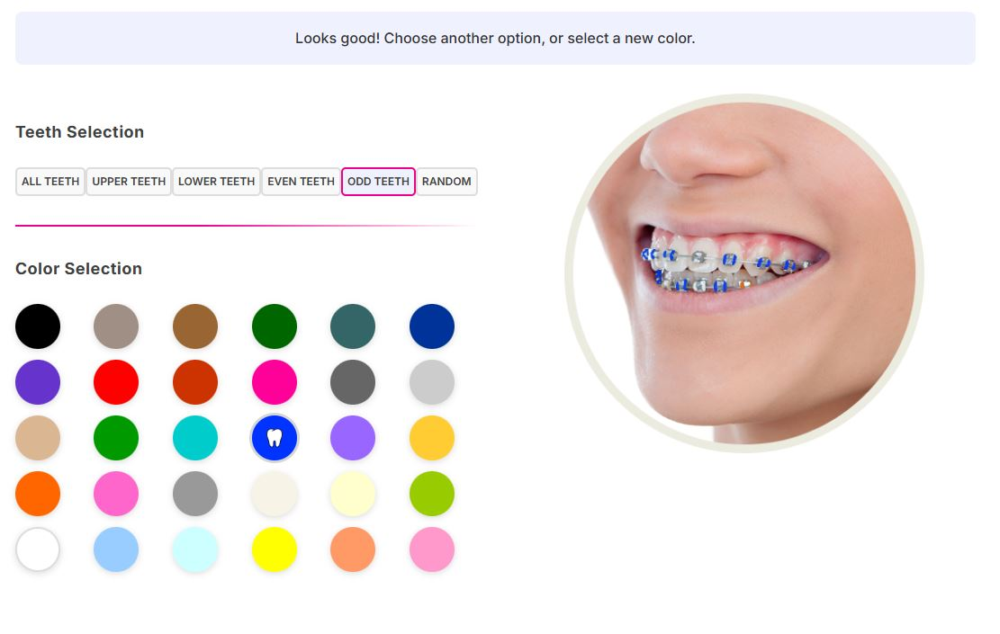

# dental-barces-color
Color My Brace is a lightweight WordPress plugin designed for dental and orthodontic websites. It allows you to visually customize and color tooth braces in images or illustrations, helping dentists, clinics, and bloggers present orthodontic content in a more engaging and attractive way.
Perfect for dental professionals, orthodontic clinics, and health bloggers who want clearer, more appealing visual content related to braces.

## Installation

1. Upload the `color-my-braces` folder to `/wp-content/plugins/`
2. Go to **Plugins** in the WordPress admin
3. Activate the **Color My Braces** plugin
4. Use the shortcode `[color_my_braces]` on any page or post

## Usage

Simply add the following shortcode to any page or post:

\`\`\`
[color_my_braces]
\`\`\`

## Features

- Interactive color picker with 28 color options
- Multiple selection modes (All, Upper, Lower, Even, Odd, Random)
- Real-time preview of brace colors
- Responsive design for mobile and desktop
- Individual bracket selection

## Requirements

- WordPress 5.0 or higher
- PHP 7.2 or higher

